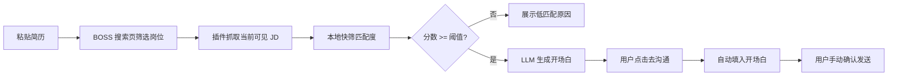

# 求职加速器

一个面向 BOSS 直聘搜索页的半自动求职助手：用户粘贴简历，插件抓取岗位 JD，本地快速筛选匹配度，只对高潜岗位调用 LLM 生成定制开场白，最后由用户手动确认发送。

普通 Windows 用户试用可以先看 `朋友使用说明.txt`，开发和二次修改再看下面的完整说明。

## 文档索引

- [免责声明](docs/disclaimer.md)
- [安装和运行排错](docs/troubleshooting.md)
- [准确率评估说明](docs/evaluation.md)
- [BOSS 页面稳定性实测清单](docs/stability_checklist.md)
- [截图和 GIF 演示清单](docs/demo.md)
- [旧入口说明](docs/legacy_entrypoints.md)

## 当前主流程



这个项目不是全自动群发工具。它的边界是：自动筛选、自动生成、自动填入，最终发送动作由用户确认。

## 架构

```text
plugin/
  popup.html/js   粘贴简历、匹配阈值、排除关键词、保存配置
  content.js      抓岗位卡片和详情、调 /match、展示结果、统计、导出 CSV、去沟通填话术

server.py         FastAPI 服务，提供 /health 和 /match
pipeline.py       简历画像、本地快筛、LLM 开场白、评分兜底
skills.json       无简历时的默认技能画像
```

核心策略是两阶段分析：

1. 本地规则先快速判断 JD 和简历画像的匹配度。
2. 只有高潜岗位才调用 LLM 写开场白，避免每个岗位都排队超时。
3. 简历会先提取成 skills_profile 并缓存在后端内存里，同一份简历后续复用，不反复发送全文。

## 安装依赖

Windows 普通用户优先使用：

```text
start_server.bat
```

脚本会自动创建 `.venv` 并安装 `requirements-backend.txt` 里的后端最小依赖。这个路径只服务 Chrome 插件主流程。

开发者也可以手动安装后端依赖：

```bash
python -m venv .venv
.venv/Scripts/python -m pip install -r requirements-backend.txt
```

如果你要二次开发完整仓库，可以使用 `uv`：

```bash
git clone <repo-url>
cd job-accelerator
uv sync
```

当前后端主线按 Python 3.10+ 验证。旧 Streamlit/Deep Agents/Playwright 实验入口不是普通用户路径，如果要运行这些旧入口，再安装可选依赖：

```bash
uv sync --extra legacy
```

## 配置模型

复制模板：

```bash
cp .env.example .env
```

推荐使用通用配置，不要把 API Key 写进代码：

```env
LLM_PROVIDER=deepseek
LLM_API_KEY=你的模型 API Key
LLM_MODEL=deepseek-v4-flash
LLM_BASE_URL=
```

支持的 `LLM_PROVIDER`：

```text
none              不调用模型，只用本地兜底
deepseek          DeepSeek
volcengine        豆包 / 火山方舟
qwen              通义千问 / DashScope
moonshot          Kimi / Moonshot
zhipu             智谱 GLM
siliconflow       SiliconFlow 网关
openrouter        OpenRouter 网关
openai            OpenAI 官方接口
openai-compatible 自定义 OpenAI-compatible 网关
```

豆包 / 火山方舟示例：

```env
LLM_PROVIDER=volcengine
LLM_API_KEY=你的火山方舟 API Key
LLM_MODEL=你的火山方舟模型或 endpoint id
LLM_BASE_URL=
```

性能相关默认值：

```env
LLM_MIN_SCORE=75
LLM_OPENING=true
LLM_MATCHER=false
LLM_RESUME_EXTRACTOR=auto
RESUME_EXTRACT_ATTEMPTS=1
LLM_JD_DECOMPOSER=false
```

含义：

- `LLM_MIN_SCORE=75`：本地快筛 75 分以上才调用 LLM。
- `LLM_OPENING=true`：让 LLM 只负责高潜岗位的开场白。
- `LLM_MATCHER=false`：匹配分默认由本地规则算，避免每条岗位都慢。
- `LLM_RESUME_EXTRACTOR=auto`：有模型时首次提取简历画像，失败就本地兜底。

旧的 `DEEPSEEK_*` 环境变量仍兼容，但新用户建议使用 `LLM_*`。

## 启动后端

Windows 普通用户可以直接双击：

```text
start_server.bat
```

脚本会自动进入项目目录并启动 `http://127.0.0.1:8000`。如果没有 `.env`，它会先从 `.env.example` 创建一份 `.env`，提示你填好模型 API Key 后再重新双击。

首次运行时，脚本会创建 `.venv` 并根据 `requirements-backend.txt` 安装后端依赖，需要联网。

命令行启动：

```bash
uv run python server.py
```

如果你已经在当前环境安装好依赖，也可以：

```bash
python server.py
```

检查服务：

```bash
curl http://127.0.0.1:8000/health
```

重点看返回里的：

```json
{
  "provider": "deepseek",
  "api_key_configured": true,
  "two_stage": true,
  "llm_min_score": 75,
  "llm_resume_extractor": true,
  "llm_opening": true
}
```

## 加载 Chrome 插件

1. 打开 `chrome://extensions/`
2. 打开「开发者模式」
3. 点击「加载已解压的扩展程序」
4. 选择项目里的 `plugin/` 目录
5. 打开 BOSS 直聘搜索页
6. 点击插件图标，粘贴简历，保存配置
7. 点击开始分析

## 使用建议

先在 BOSS 直聘页面里设置好城市、岗位、薪资、经验、学历等筛选条件，再启动插件分析。

插件会保留低匹配岗位，因为真实求职场景里需要看到“不适合”的原因。匹配阈值主要用于判断哪些岗位值得生成开场白和进入沟通动作。

如果页面出现反爬刷新或岗位列表异常，先降低单次扫描数量，等待页面稳定后继续扫描。

安装失败、后端连不上、LLM 超时、读不到 JD 等问题见 [安装和运行排错](docs/troubleshooting.md)。

## 隐私

- `.env` 已被 `.gitignore` 忽略，不要提交真实 API Key。
- 简历文本保存在 Chrome 本地存储中，用于插件调用本地后端。
- 后端会把简历提取成技能画像，默认只缓存在内存里，重启服务后清空。
- 只有达到阈值的高潜岗位才会把 JD 摘要、匹配技能和精简简历证据发送给你配置的 LLM。
- 如果 `LLM_PROVIDER=none`，则不会调用外部模型，只使用本地兜底。

## 免责声明

本项目不是 BOSS 直聘官方工具，也不承诺提高投递成功率。它只做辅助筛选、开场白草稿和半自动填入，最终发送动作由用户自己确认。详细说明见 [免责声明](docs/disclaimer.md)。

## 已知限制

- BOSS 直聘页面结构和反爬策略可能变化，插件需要持续维护 DOM 选择器和扫描节奏。
- 自动填开场白后仍需要用户手动确认发送。
- 开场白质量取决于简历证据、JD 质量和所选模型。
- 当前缓存是本地缓存和后端内存缓存，不是跨设备账号系统。
- 真实截图/GIF 需要用打码后的页面素材补充，建议见 [截图和 GIF 演示清单](docs/demo.md)。

## 旧入口

仓库里保留了早期 Streamlit、Deep Agents 和实习僧相关实验文件，用于展示项目演进，不是当前 Chrome 插件主流程。说明见 [旧入口说明](docs/legacy_entrypoints.md)。

## License

MIT License，见 [LICENSE](LICENSE)。

## 面试讲法

这个项目可以概括为：

> 我做了一个半自动求职助手，把重复的岗位筛选、JD 阅读和开场白编写拆成 Chrome 插件、FastAPI 后端和匹配流水线三层。为了避免每个岗位都调用大模型导致超时，我设计了两阶段分析：先本地快筛，再只对高潜岗位调用 LLM 生成开场白，同时把简历提取成可复用的技能画像，减少 token 和等待时间。
