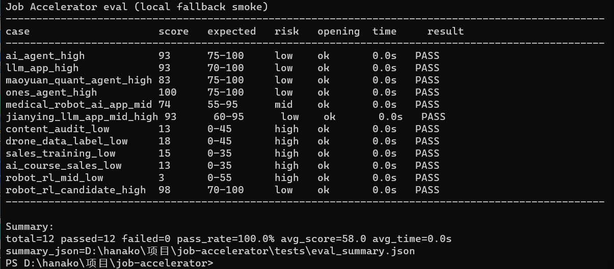
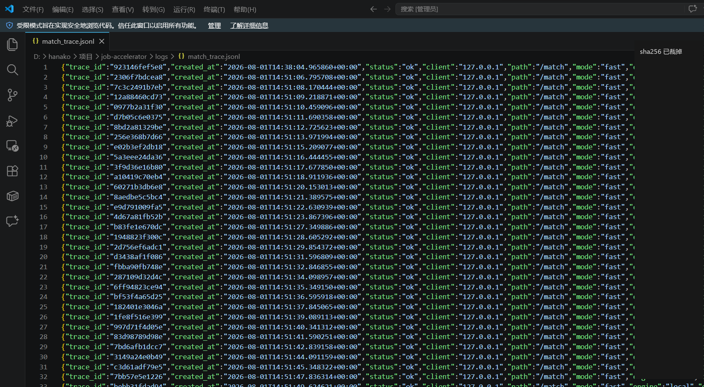
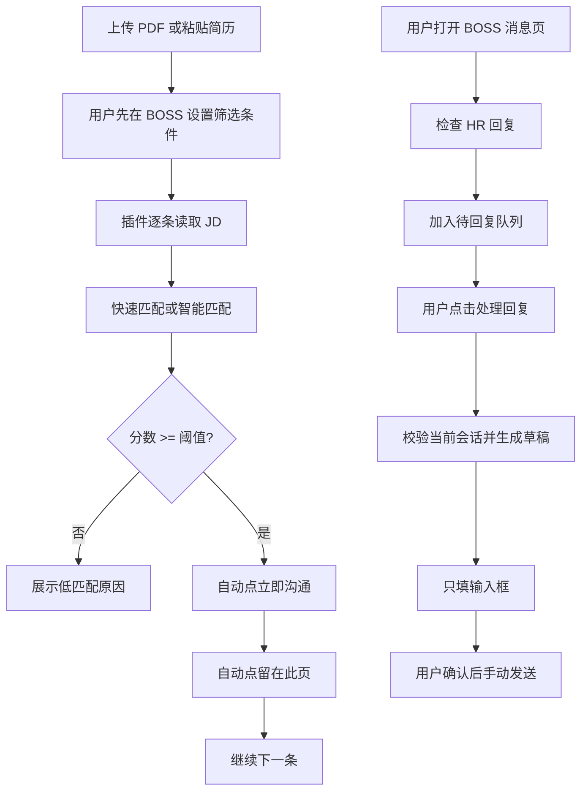

# 求职加速器

一个面向 BOSS 直聘的半自动求职效率工具：用户上传 PDF 或粘贴简历后，插件在岗位页完成 JD 匹配和达标岗位沟通；在消息页发现 HR 回复后，用户可以让插件生成并填入回复草稿，再由用户检查和发送。

普通 Windows 用户试用可以先看 `朋友使用说明.txt`，开发和二次修改再看下面的完整说明。

## 文档索引

- [免责声明](docs/disclaimer.md)
- [安装和运行排错](docs/troubleshooting.md)
- [云端部署说明](docs/cloud_deploy.md)
- [演示与朋友包说明](docs/online_demo.md)
- [后端 API 结构](docs/backend_api.md)
- [准确率评估说明](docs/evaluation.md)
- [Trace 日志 / 调用记录](docs/trace_logging.md)
- [简历与面试准备](docs/interview_prep.md)
- [BOSS 页面稳定性实测清单](docs/stability_checklist.md)
- [截图和 GIF 演示清单](docs/demo.md)
- [旧入口说明](docs/legacy_entrypoints.md)

## 演示与朋友包

- 公开仓库不声明长期可用的在线后端，也不保存朋友测试环境的真实地址或访问令牌。
- 本地启动后可访问 `http://127.0.0.1:8000/health` 检查后端状态。
- 完整插件体验需要 Chrome 扩展、BOSS 登录态和私有朋友包，不做公开免登录 Demo。
- 朋友包由 `scripts/build_friend_plugin.ps1` 生成，真实 HTTPS 地址和访问令牌只在打包时注入。

演示边界见 [演示与朋友包说明](docs/online_demo.md)。真实 BOSS 页面截图和 GIF 需要打码后放到 `docs/assets/`，清单见 [截图和 GIF 演示清单](docs/demo.md)。

## 项目证据





## 当前主流程



这个项目的第一版重点是减少重复筛岗位、重复点沟通和重复组织基础回复的时间。HR 回复助手不会自动发送，证据不足、高风险问题或会话不一致时会停止填入并提示用户接管。

## 架构

```text
plugin/
  popup.html/js   PDF/文本简历、投递模式、阈值、待回复队列
  content.js      job/message/chat 三种页面模式、DOM 操作、task lock、状态面板
  background.js   代表 content script 请求云端后端，避免 HTTPS 页面直连 HTTP 被拦截
  config.js       源码版使用本地后端；朋友包打包时替换云端地址和访问令牌

server.py         FastAPI 服务，提供 /health、/match、/resume/parse、/chat/reply
pipeline.py       简历画像、本地快筛、智能兜底、HR 回复意图与证据护栏
skills.json       无简历时的默认技能画像
```

核心策略是两阶段分析：

1. 本地规则先快速判断 JD 和简历画像的匹配度。
2. 快速投递完全不依赖 LLM；智能投递只把模型当增强能力，超时或繁忙时回到本地结果。
3. 简历会先提取成 skills_profile 并缓存在后端内存里，同一份简历后续复用，不反复发送全文。
4. HR 回复助手先校验会话和最后发言角色，再按风险与证据决定是否填草稿；它不会点击发送。
5. 云端后端为快速匹配、智能匹配、PDF 解析和 HR 回复设置独立并发门控，聊天模型不会拖住快速海投。

## 安装依赖

Windows 普通用户优先使用：

```text
start_server.bat
```

脚本会自动创建 `.venv` 并安装 `requirements-backend.txt` 里的后端最小依赖。这个路径只服务 Chrome 插件主流程。

开发者也可以手动安装后端依赖：

```bash
python -m venv .venv
.venv/Scripts/python -m pip install -r requirements-backend.txt
```

如果你要二次开发完整仓库，可以使用 `uv`：

```bash
git clone <repo-url>
cd job-accelerator
uv sync
```

当前后端主线按 Python 3.10+ 验证。旧 Streamlit/Deep Agents/Playwright 实验入口不是普通用户路径，如果要运行这些旧入口，再安装可选依赖：

```bash
uv sync --extra legacy
```

## 配置模型

复制模板：

```bash
cp .env.example .env
```

推荐使用通用配置，不要把 API Key 写进代码：

```env
LLM_PROVIDER=deepseek
LLM_API_KEY=你的模型 API Key
LLM_MODEL=deepseek-v4-flash
LLM_BASE_URL=
```

支持的 `LLM_PROVIDER`：

```text
none              不调用模型，只用本地兜底
deepseek          DeepSeek
volcengine        豆包 / 火山方舟
qwen              通义千问 / DashScope
moonshot          Kimi / Moonshot
zhipu             智谱 GLM
siliconflow       SiliconFlow 网关
openrouter        OpenRouter 网关
openai            OpenAI 官方接口
openai-compatible 自定义 OpenAI-compatible 网关
```

豆包 / 火山方舟示例：

```env
LLM_PROVIDER=volcengine
LLM_API_KEY=你的火山方舟 API Key
LLM_MODEL=你的火山方舟模型或 endpoint id
LLM_BASE_URL=
```

性能相关默认值：

```env
LLM_MIN_SCORE=75
LLM_OPENING=true
LLM_MATCHER=false
LLM_RESUME_EXTRACTOR=auto
RESUME_EXTRACT_ATTEMPTS=1
LLM_JD_DECOMPOSER=false
```

云端朋友试用版还建议配置：

```env
JOB_ACCELERATOR_FAST_CONCURRENCY=8
JOB_ACCELERATOR_SMART_CONCURRENCY=1
JOB_ACCELERATOR_CHAT_REPLY_CONCURRENCY=2
JOB_ACCELERATOR_PDF_CONCURRENCY=2
JOB_ACCELERATOR_RATE_LIMIT_PER_MINUTE=120
JOB_ACCELERATOR_SMART_LLM_TIMEOUT=5
JOB_ACCELERATOR_CHAT_REPLY_SLOW_TIMEOUT=4
JOB_ACCELERATOR_CHAT_REPLY_LLM=false
```

含义：

- `LLM_MIN_SCORE=75`：本地快筛 75 分以上才调用 LLM。
- `LLM_OPENING=true`：让 LLM 只负责高潜岗位的开场白。
- `LLM_MATCHER=false`：匹配分默认由本地规则算，避免每条岗位都慢。
- `LLM_RESUME_EXTRACTOR=auto`：有模型时首次提取简历画像，失败就本地兜底。
- `JOB_ACCELERATOR_SMART_CONCURRENCY=1`：智能模式限并发，忙时走快速兜底，不拖慢海投。
- `JOB_ACCELERATOR_CHAT_REPLY_LLM=false`：默认使用快速模板和本地证据护栏；设为 `true` 后，技术/项目类回复可尝试模型增强，失败仍会兜底。

旧的 `DEEPSEEK_*` 环境变量仍兼容，但新用户建议使用 `LLM_*`。

## 启动后端

Windows 普通用户可以直接双击：

```text
start_server.bat
```

脚本会自动进入项目目录并启动 `http://127.0.0.1:8000`。如果没有 `.env`，它会先从 `.env.example` 创建一份 `.env`，提示你填好模型 API Key 后再重新双击。

首次运行时，脚本会创建 `.venv` 并根据 `requirements-backend.txt` 安装后端依赖，需要联网。

命令行启动：

```bash
uv run python server.py
```

如果你已经在当前环境安装好依赖，也可以：

```bash
python server.py
```

检查服务：

```bash
curl http://127.0.0.1:8000/health
```

重点看返回里的：

```json
{
  "success": true,
  "data": {
    "ok": true,
    "llm": {
      "provider": "deepseek",
      "api_key_configured": true,
      "two_stage": true,
      "llm_min_score": 75,
      "llm_resume_extractor": true,
      "llm_opening": true
    }
  }
}
```

## 加载 Chrome 插件

1. 打开 `chrome://extensions/`
2. 打开「开发者模式」
3. 点击「加载已解压的扩展程序」
4. 选择项目里的 `plugin/` 目录
5. 打开 BOSS 直聘搜索页
6. 点击插件图标，上传 PDF 或粘贴简历
7. 选择「快速投递」或「智能投递」
8. 在 BOSS 消息页可以点击「检查 HR 回复」，再手动选择需要处理的会话

## 使用建议

先在 BOSS 直聘页面里设置好城市、岗位、薪资、经验、学历等筛选条件，再启动插件分析。

插件会保留低匹配岗位，因为真实求职场景里需要看到“不适合”的原因。匹配阈值用于判断哪些岗位可以进入自动沟通动作。

HR 回复助手只填草稿。薪资、到岗、驻场/远程、敏感信息、证据不足的技术问题会提示用户接管；当前会话与队列记录不一致时不会请求后端，也不会填入。

如果页面出现反爬刷新或岗位列表异常，先降低单次扫描数量，等待页面稳定后继续扫描。

安装失败、后端连不上、LLM 超时、读不到 JD 等问题见 [安装和运行排错](docs/troubleshooting.md)。

## 隐私

- `.env` 已被 `.gitignore` 忽略，不要提交真实 API Key。
- 简历文本保存在 Chrome 本地存储中，用于插件调用本地后端。
- 后端会把简历提取成技能画像，默认只缓存在内存里，重启服务后清空。
- 智能投递或技术类 HR 回复启用模型增强时，必要的 JD、简历证据和聊天上下文可能会发送给配置的模型服务商。
- 如果 `LLM_PROVIDER=none`，则不会调用外部模型，只使用本地兜底。
- Trace 默认只记录长度、hash 和结构化指标，不记录完整简历、JD、聊天正文或生成草稿。

## 免责声明

本项目不是 BOSS 直聘官方工具，也不承诺提高投递成功率。当前快速海投会在达标岗位上自动点击「立即沟通」，并尝试在 BOSS 弹窗中选择「留在此页」继续处理下一条；使用者需要自行设置筛选条件、投递节奏和账号风险边界。详细说明见 [免责声明](docs/disclaimer.md)。

## 已知限制

- BOSS 直聘页面结构和反爬策略可能变化，插件需要持续维护 DOM 选择器和扫描节奏。
- 自动沟通依赖 BOSS 当前弹窗文案和页面结构；如果识别不到「留在此页」，插件应暂停并提示手动处理。
- HR 回复助手依赖 BOSS 当前聊天 DOM；会话证据不明确时会保守停止，需要用户手动处理。
- 当前缓存是本地缓存和后端内存缓存，不是跨设备账号系统。
- 真实截图/GIF 需要用打码后的页面素材补充，建议见 [截图和 GIF 演示清单](docs/demo.md)。

## 旧入口

仓库里保留了早期 Streamlit、Deep Agents 和实习僧相关实验文件，用于展示项目演进，不是当前 Chrome 插件主流程。说明见 [旧入口说明](docs/legacy_entrypoints.md)。

## License

MIT License，见 [LICENSE](LICENSE)。

## 面试讲法

更完整的简历描述、1 分钟讲稿和 10 个常见追问见 [简历与面试准备](docs/interview_prep.md)。

这个项目可以概括为：

> 我做了一个面向 BOSS 的半自动求职助手，把岗位扫描、JD 匹配、达标沟通和 HR 回复草稿整合到同一个 Chrome 插件。快速投递完全走本地规则，智能能力超时会兜底；消息页通过 task lock、会话证据校验和风险策略保证只填正确会话的草稿、不自动发送。后端使用 FastAPI 提供匹配、PDF 解析和回复接口，并用独立并发门控、脱敏 Trace 和固定样本回归提升可维护性。
